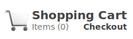

# Instructions

## Getting started

1. Copy the files `cart.css`, and `cart.js` to the folder with your site.

2. Connect each page of your site to the `cart.css` file:

    ```html
    <link rel="stylesheet" href="[path_to_css]/cart.css">
    ```

3. Connect each page of your site to the `cart.js` file:

    ```html
    <script src="[path_to_js]/cart.js"></script>
    ```


## Cart settings

Open the cart.js file and edit the configuration section.

1. Create as many products as you want. Just make sure that the ID is unique for each item. IDs don't need to be sequential and they can include any alpha-numeric character. Product IDs are not case-sensitive.

2. Edit the shipping section. Set `free_shipping` to `false` if you plan on charging for shipping, `true` otherwise. Set `shipping_rate` to the amount you'd like to charge for shipping.

3. Make sure the file names in `site settings` match those used on your site.

4. Optionally, you can edit the `cart_name` settings. The `cart_name` doesn't affect how the site works. However if you are running more than cart on the same server, each should have a unique name.


## Using js-cart functions in your HTML

1. Add an `onload` event to the body of each page that needs to read cart data.

    ```html
    <body onload="loadCart()">
    ```

2. On the cart page, include empty div tags with the `id="cart"` where you would like the cart to appear. You should not put anything between the tags. The `cart.js` file has functions that will automatically create a table of all items in the cart between the tags.

    ```html                                                        
    <div id="cart"></div>
    ```
   If you preview the cart at this point, you should see a message stating the cart is empty along with a working link to the home page.                              
3. The simplest way to allow shoppers to add product to their cart is by creating an 'Add to Cart' button. The button's `onclick` attribute should call the `addToCart` function and pass the item's ID as a parameter.

    ```html
    <input type="button" onclick="addToCart('001')" value="Add to cart">
    ```

    It is also possible to create drop-down menus with options product options such as color or size. The second parameter of the `setChoice` function should match the `id` attribute of the corresponding add-to-cart input button. Option values correspond to individual product IDs in the `cart.js` configuration. Also be sure that the first option has a value of `""`. Notice that the input is disabled unless a selection is made.

    ```html
    <h3>Doomahitchy - $20.00</h3>
    <select onchange="setChoice(this, 'xyz')">
      <option value="">Select a color...</option>
      <option value="xyz-red">Red</option>
      <option value="xyz-green">Green</option>
      <option value="xyz-blue">Blue</option>
    </select>
    <input id="xyz" type="button" value="Add to Cart" disabled>
    ```

   You can test by clicking the button. Each time you click a button, a popup should notify you that the item was added to the cart. Visit the cart page and confirm that the items were added to the cart and price calculations are correct.

4. The page that confirms an order has been successfully placed can use an `onload` event to empty the cart.                                                                   
    ```html
    <body onload="emptyCart()">
    ```


## More options

1. You can also add tags to display the count of items in the cart. Each time an item is added/removed from the cart, item count will update automatically.

    ```html
    <span id="item_count">0</span>
    ```

2. You do not need to add a link to your checkout page as it will  be reachable by clicking 'checkout' on the cart page. However, if you do choose to provide a link to your checkout page, you can add an `id="checkout_link"` attribute. Then the link will point to the cart page rather than checkout if the cart is empty.

    ```html
    <a id="checkout_link" href="checkout.html">Checkout</a>
    ```


## Cart widget

Instead of the options above, you can also include a widget which displays a cart icon, a link to the cart, the the number of items in the cart, and a dynamic link to the cart or checkout page. Copy the html code below to the pages for which you would like to display the widget. Links created will reflect those configured in 'site settings'.

#### Screenshot:



#### Code:

```html
<!-- begin cart link widget -->
<div id="cart_links">
    <a href="cart.html"></a>
    <span class="cart_link"><a id="cart_link" href="#">Shopping Cart</a></span> <br />
    <span class="item_count">Items (<span id="item_count">0</span>)</span>
    <span class="checkout_link"><a id="checkout_link" href="#">Checkout</a></span>
</div>
<!-- end widget -->
```


## Optional Styling

The `cart.css` file contains basic styling for both the cart table and widget. Most cells in the cart table have unique class names which should give plenty of options for styling the cart table if desired. Styles for the cart widget are also in this file.                 
